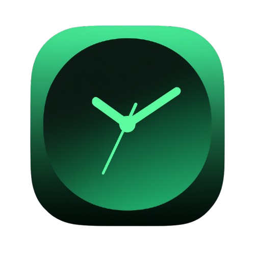

# Trackich

> 🎯 **Personal Time Tracking Made Simple**  
> A beautiful, cross-platform productivity companion designed specifically for remote workers and freelancers.

<p align="center">
  
</p>

## ✨ What Makes Trackich Special

**🔥 Core Features**
- **⏰ Smart Time Tracking** - Track work sessions with one-click start/stop
- **📊 Advanced Analytics** - Focus score based on Attention Residue algorithm
- **🎨 Project Management** - Organize tasks by colorful projects with archive support
- **📅 Calendar Integration** - Visual timeline of your productivity
- **🌙 Health-Conscious** - Smart break reminders to prevent burnout

**📈 Professional Tools**
- **📑 Excel Export** - Generate detailed XLSX reports for clients or accounting
- **🎯 Focus Optimization** - Context-switch analysis and deep work tracking
- **📱 Cross-Platform** - Works seamlessly on macOS, Windows, Linux, iOS & Android
- **🌐 Multi-Language** - Full support for English and Russian
- **🔔 Smart Notifications** - Customizable break reminders and work alerts

**💎 Why Choose Trackich?**
- **No Subscriptions** - Buy once, use forever
- **Privacy First** - All data stays on your device
- **Remote Work Optimized** - Built by remote workers, for remote workers
- **Beautiful Design** - Native look and feel on every platform

## 🚀 Quick Start

### Prerequisites

- [Flutter SDK](https://docs.flutter.dev/get-started/install) (3.0+)
- [Dart SDK](https://dart.dev/get-dart) (3.0+)

### Development Setup

1. **Clone the repository**
   ```bash
   git clone <repository-url>
   cd trackich
   ```

2. **Install dependencies**
   ```bash
   flutter pub get
   ```

3. **Run the application**
   ```bash
   # Desktop (macOS/Windows/Linux)
   flutter run -d macos
   flutter run -d windows  
   flutter run -d linux
   
   # Mobile
   flutter run -d ios
   flutter run -d android
   ```

## 📦 Building Release Versions

### 🍎 macOS

1. **Build the application**
   ```bash
   flutter build macos --release
   ```

2. **Create DMG installer**
   
   Install create-dmg tool:
   ```bash
   brew install create-dmg
   ```
   
   Create DMG:
   ```bash
   ./create-dmg.sh
   ```
   
   Or manually:
   ```bash
   # Create clean temp directory
   mkdir -p /tmp/trackich_clean
   cp -R "build/macos/Build/Products/Release/Trackich.app" /tmp/trackich_clean/
   
   # Create DMG
   create-dmg \
     --volname "Trackich" \
     --window-pos 200 120 \
     --window-size 600 400 \
     --icon-size 100 \
     --icon "Trackich.app" 150 200 \
     --hide-extension "Trackich.app" \
     --app-drop-link 450 200 \
     "Trackich.dmg" \
     "/tmp/trackich_clean/"
   
   # Cleanup
   rm -rf /tmp/trackich_clean
   ```

**Output:** `Trackich.dmg` ready for distribution

### 🪟 Windows

**Native (Windows host only):**
```bash
flutter build windows --release
```

**Cross-platform (macOS/Linux with Docker):**
```bash
./build-windows.sh
```

**Output:** `build/windows/x64/runner/Release/` or `dist/windows/`

### 🐧 Linux

**Native (Linux host only):**
```bash
# Install dependencies first
sudo apt-get install clang cmake ninja-build pkg-config libgtk-3-dev
flutter build linux --release
```

**Cross-platform (macOS/Windows with Docker):**
```bash
./build-linux.sh
```

**Output:** `build/linux/x64/release/bundle/` or `dist/linux/`

### ☁️ GitHub Actions (All Platforms)

Push a tag to automatically build for all platforms:
```bash
git tag v1.0.0
git push origin v1.0.0
```

This will create releases for macOS, Windows, and Linux automatically.

### 📱 Mobile Builds

#### iOS
```bash
flutter build ios --release
# Open ios/Runner.xcworkspace in Xcode for App Store submission
```

#### Android
```bash
# APK
flutter build apk --release

# App Bundle (recommended for Play Store)
flutter build appbundle --release
```

## 🛠️ Development Commands

```bash
# Run tests
flutter test

# Analyze code
flutter analyze

# Format code
dart format .

# Generate localization files
flutter gen-l10n

# Clean build artifacts
flutter clean
```

## 📁 Project Structure

```
trackich/
├── lib/
│   ├── core/           # Core functionality, models, services
│   ├── features/       # Feature-specific code (timer, projects, etc.)
│   ├── presentation/   # UI screens and widgets
│   └── l10n/          # Localization files
├── assets/            # Images, fonts, and other assets
├── macos/            # macOS-specific configuration
├── windows/          # Windows-specific configuration
├── linux/            # Linux-specific configuration
├── ios/              # iOS-specific configuration
└── android/          # Android-specific configuration
```

## 🌍 Localization

The app supports multiple languages:
- English (default)
- Russian

To add a new language:
1. Create `lib/l10n/app_[language_code].arb`
2. Add translations for all keys
3. Run `flutter gen-l10n`
4. Update `supportedLocales` in `lib/main.dart`

## 🔧 Configuration

### App Icons
- Update icons in platform-specific folders
- Use different sizes as required by each platform
- Current icon: `assets/images/logo_500x500.png`

### App Name & Bundle ID
- iOS: `ios/Runner/Info.plist`
- Android: `android/app/build.gradle`
- macOS: `macos/Runner/Configs/AppInfo.xcconfig`
- Windows: `windows/runner/Runner.rc`
- Linux: `linux/CMakeLists.txt`

## 📝 License

This project is licensed under the MIT License - see the [LICENSE](LICENSE) file for details.

## 🤝 Contributing

1. Fork the repository
2. Create your feature branch (`git checkout -b feature/amazing-feature`)
3. Commit your changes (`git commit -m 'Add some amazing feature'`)
4. Push to the branch (`git push origin feature/amazing-feature`)
5. Open a Pull Request

## 📧 Support

For support and questions, please open an issue on GitHub.
